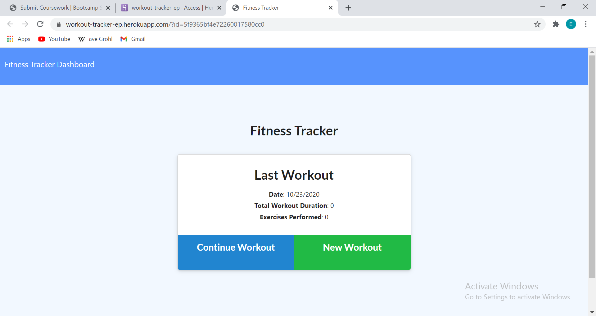
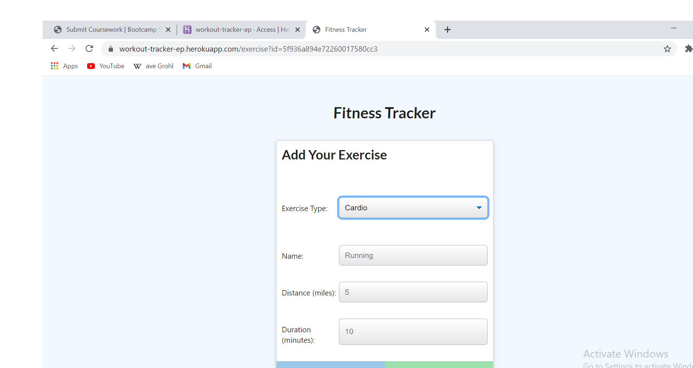
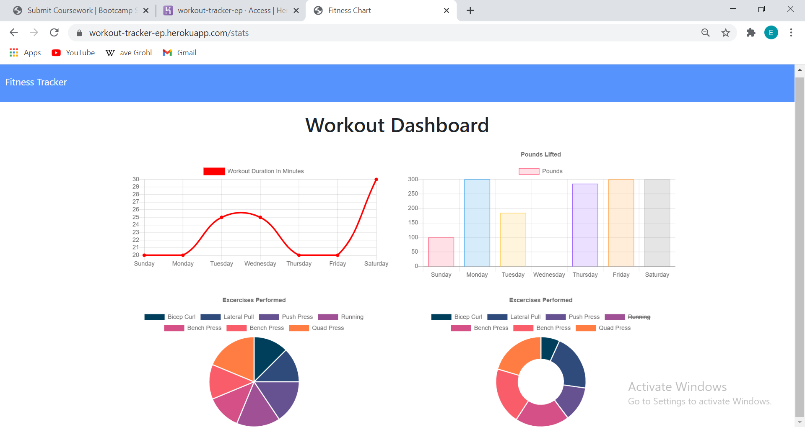

# Workout Tracker

## Description

Workout Tracker is a data based app that will keep track of exercises, and returns the data back in the form of a pie and line graph. It will show the user their progress in a 7-day scope, so they can see their growth. The user will be able to to add new exercises by type, cardio or resistance based,  and include weight, number of reps, sets, and duration.

 ## Installation

 Workout Tracker is installed by first cloning the repo from [Edibozu](https://github.com/Edibozu/workout-tracker). Once cloned, the code can be viewed in VS Code. The application itself is deplyed on [Heroku](https://workout-tracker-ep.herokuapp.com/?id=5f936a894e72260017580cc3).
  
The image below shows the startup of the app, where the user can continue a workput or add a new workout.
  

   
This shot shows the process of adding a new workout.
  

   
Here we see the stats the user will receive in a 7-day period, based on their performance.
  

  

## Questions

For any questions, contact me on any of the following links:

Email: edibozu@gmail.com

Heroku: https://github.com/Edibozu/workout-tracker

GitHub Repo: https://github.com/Edibozu/workout-tracker

LinkedIn: https://www.linkedin.com/in/eduardo-pineda-5595431b6/

## Contributions

This application was aided by my fellow classmates during our after class study sessions. 

## License

MIT License

Copyright (c) [2020] [Eduardo Pineda]

Permission is hereby granted, free of charge, to any person obtaining a copy
of this software and associated documentation files (the "Software"), to deal
in the Software without restriction, including without limitation the rights
to use, copy, modify, merge, publish, distribute, sublicense, and/or sell
copies of the Software, and to permit persons to whom the Software is
furnished to do so, subject to the following conditions:

The above copyright notice and this permission notice shall be included in all
copies or substantial portions of the Software.

THE SOFTWARE IS PROVIDED "AS IS", WITHOUT WARRANTY OF ANY KIND, EXPRESS OR
IMPLIED, INCLUDING BUT NOT LIMITED TO THE WARRANTIES OF MERCHANTABILITY,
FITNESS FOR A PARTICULAR PURPOSE AND NONINFRINGEMENT. IN NO EVENT SHALL THE
AUTHORS OR COPYRIGHT HOLDERS BE LIABLE FOR ANY CLAIM, DAMAGES OR OTHER
LIABILITY, WHETHER IN AN ACTION OF CONTRACT, TORT OR OTHERWISE, ARISING FROM,
OUT OF OR IN CONNECTION WITH THE SOFTWARE OR THE USE OR OTHER DEALINGS IN THE
SOFTWARE.
